# Client Management Architecture

This document details the client management subsystem of LSP Mode, which handles the lifecycle, discovery, and coordination of language server clients.

## Client Management Overview

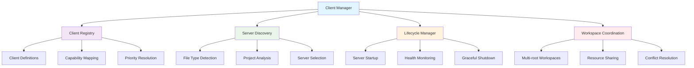

## Client Registration System

### Client Definition Structure

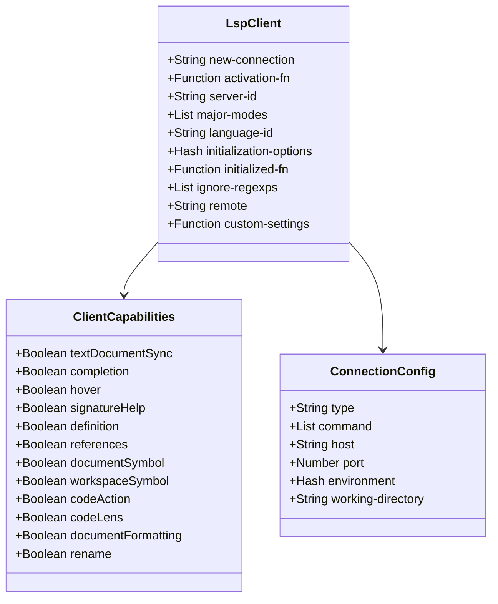

### Client Registration Flow

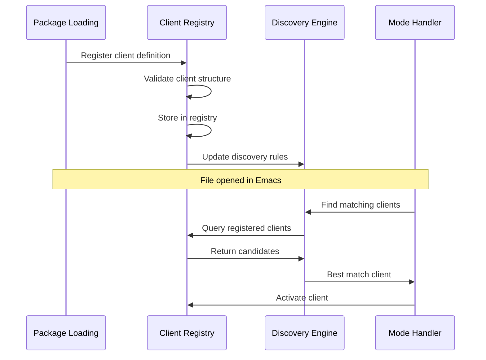

## Server Discovery and Selection

### Discovery Algorithm

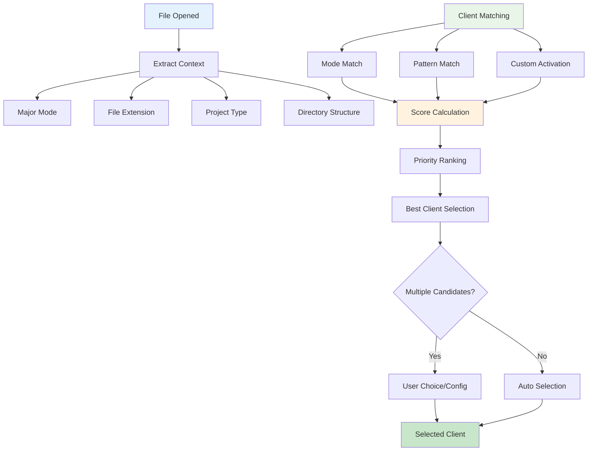

### Multi-Client Coordination

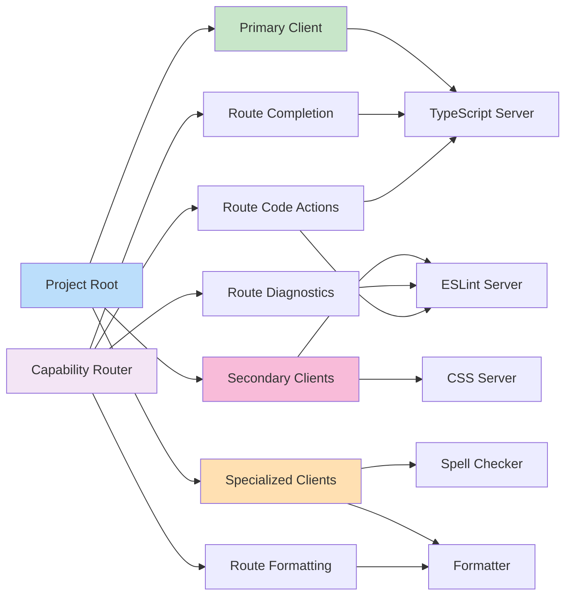

## Server Lifecycle Management

### Lifecycle State Machine

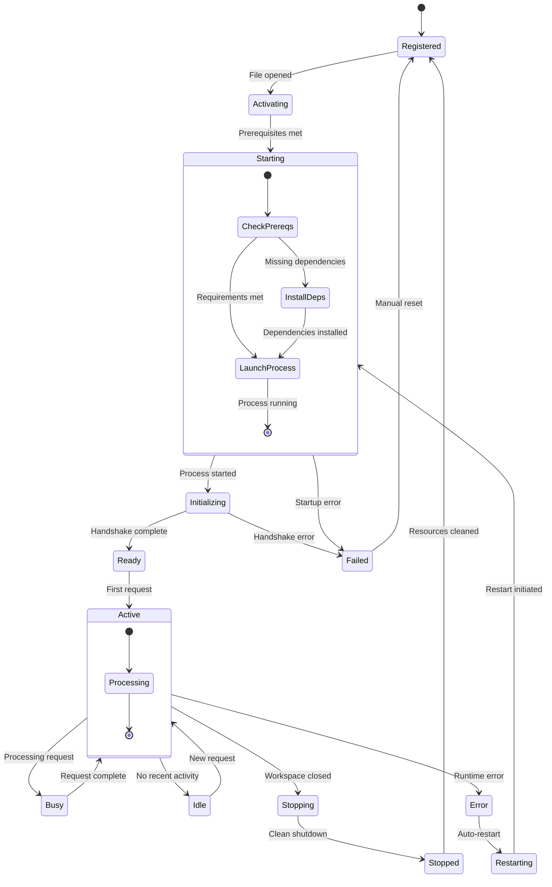

### Health Monitoring

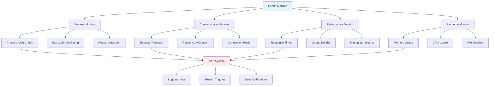

## Workspace Management

### Multi-Root Workspace Handling

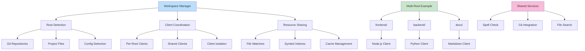

### Resource Coordination

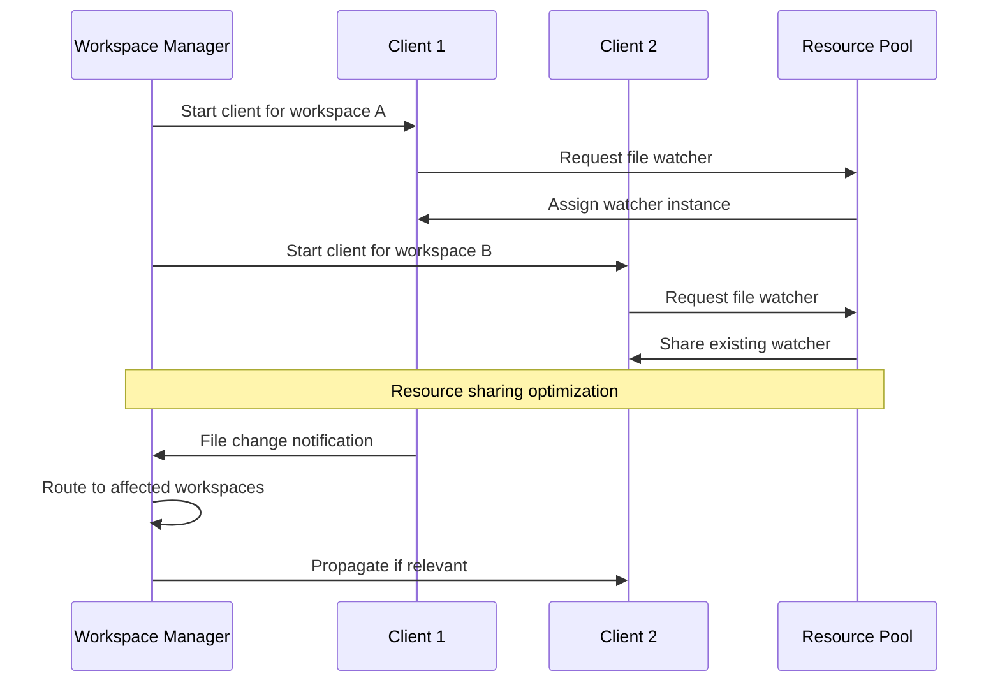

## Client Configuration Management

### Configuration Sources

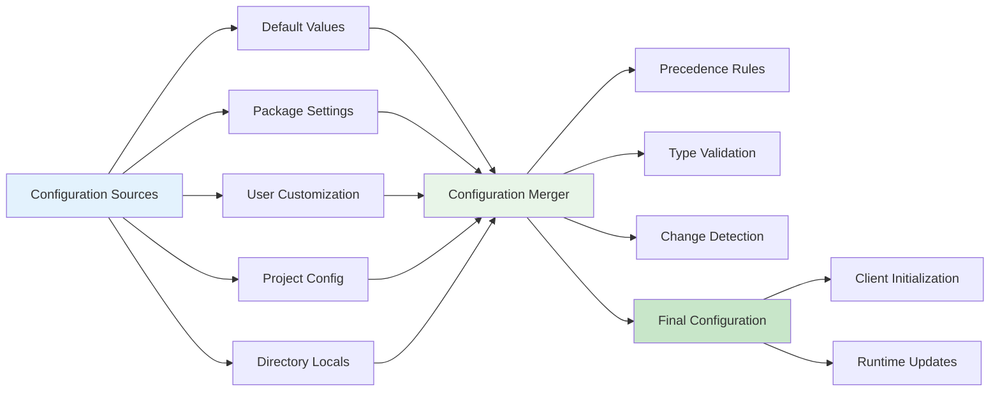

### Dynamic Configuration Updates

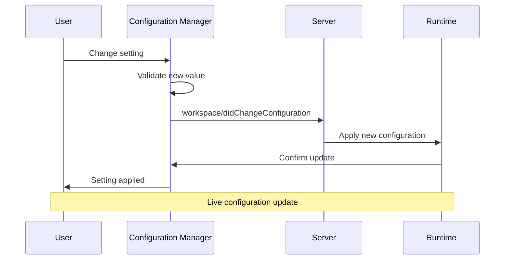

## Error Recovery and Resilience

### Failure Detection and Recovery

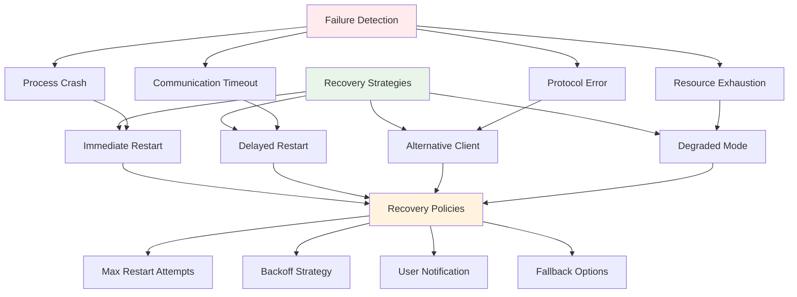

### Circuit Breaker Pattern

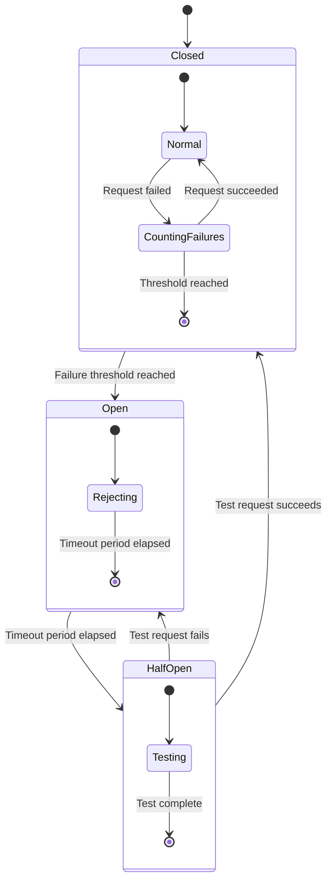

## Performance Optimization

### Client Pool Management

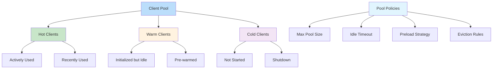

This client management architecture ensures efficient coordination of multiple language servers while maintaining system stability and performance through sophisticated lifecycle management and error recovery mechanisms.