# LSP Mode Architecture Integration Guide

This guide explains how the different architectural components of LSP Mode work together to provide a cohesive language server experience in Emacs.

## System Integration Overview

The LSP Mode architecture follows a layered approach with clear interfaces between components, enabling modular development and extensibility.

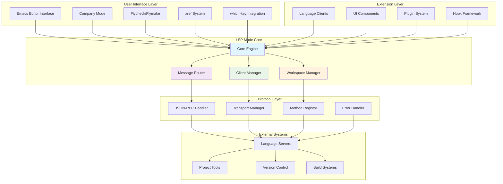

## Component Interaction Patterns

### Event-Driven Communication

The system uses an event-driven architecture where components communicate through well-defined interfaces and hooks:

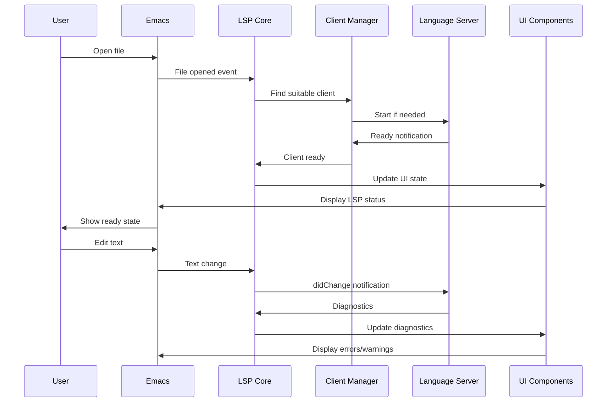

### Data Flow Integration

Data flows through the system in a predictable pattern, with each layer adding its own processing:

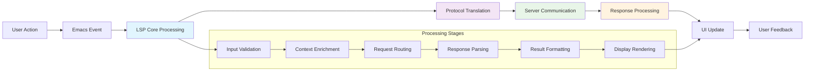

## Hook System Integration

### Core Hooks and Extension Points

The hook system provides multiple extension points for customization and plugin development:

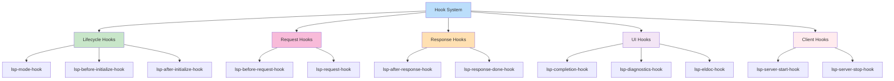

### Hook Execution Flow

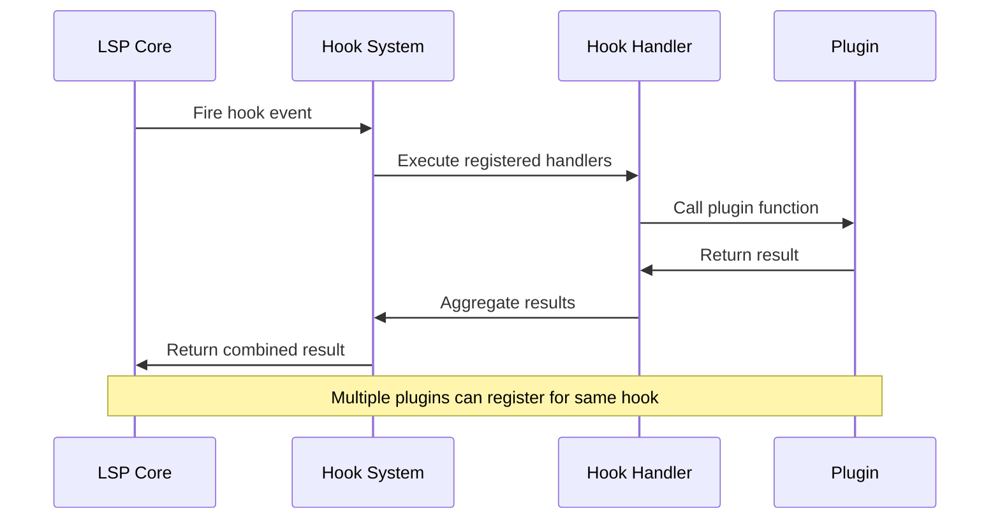

## Configuration Integration

### Multi-Level Configuration System

Configuration is merged from multiple sources with clear precedence rules:

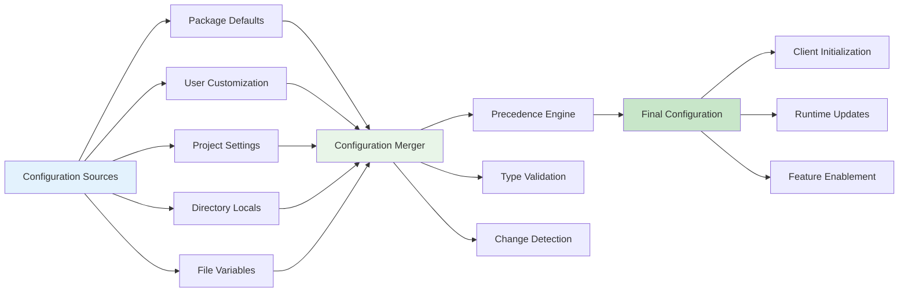

### Configuration Propagation

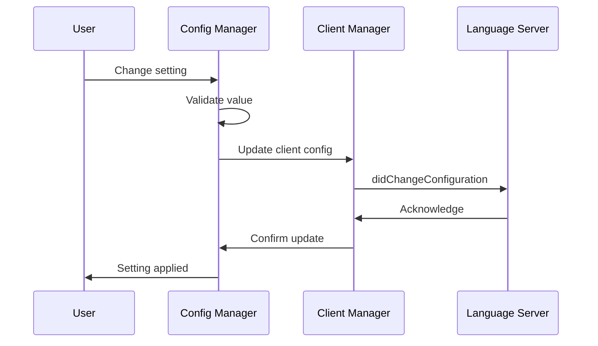

## Performance Integration Patterns

### Asynchronous Processing Architecture

The system maximizes responsiveness through comprehensive asynchronous processing:

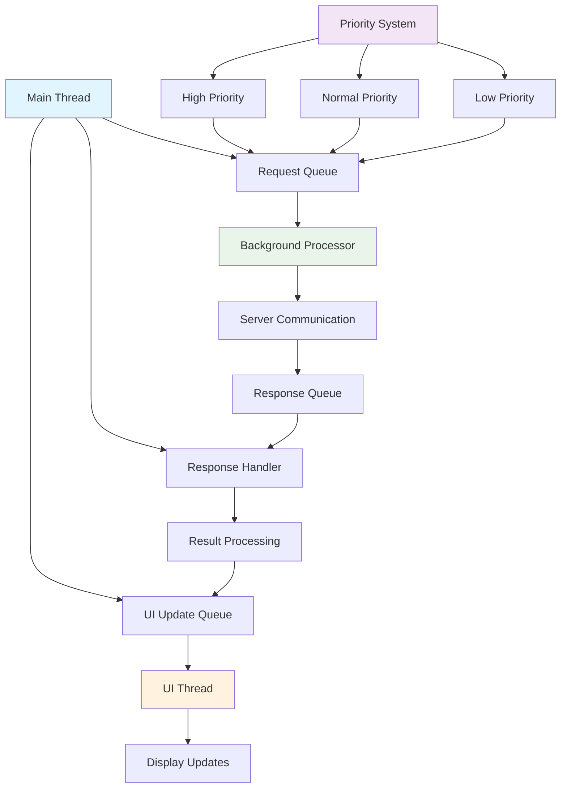

### Caching Integration Strategy

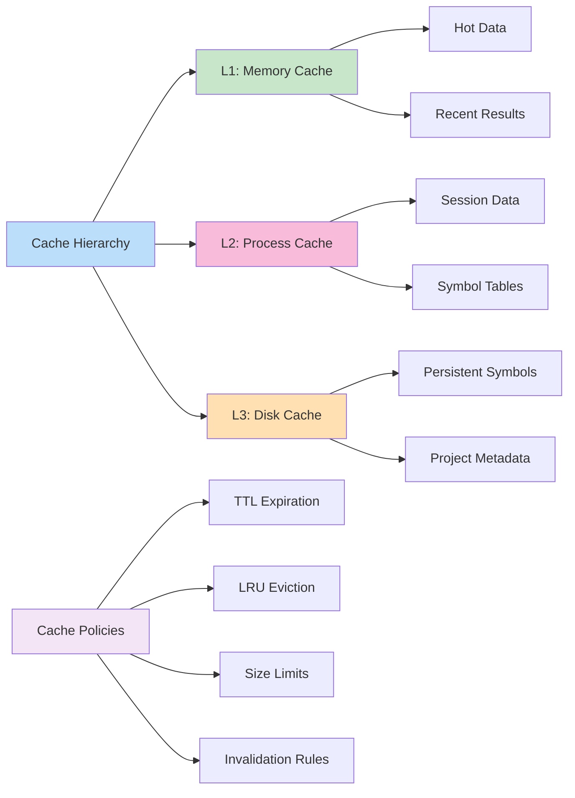

## Error Handling Integration

### Multi-Layer Error Recovery

Error handling is coordinated across all layers to provide graceful degradation:

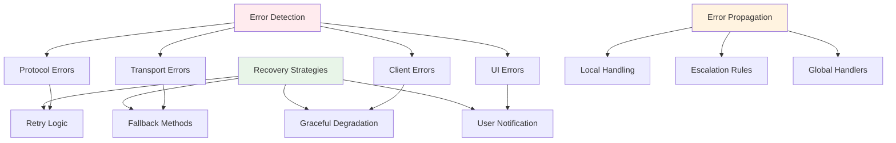

### Circuit Breaker Integration

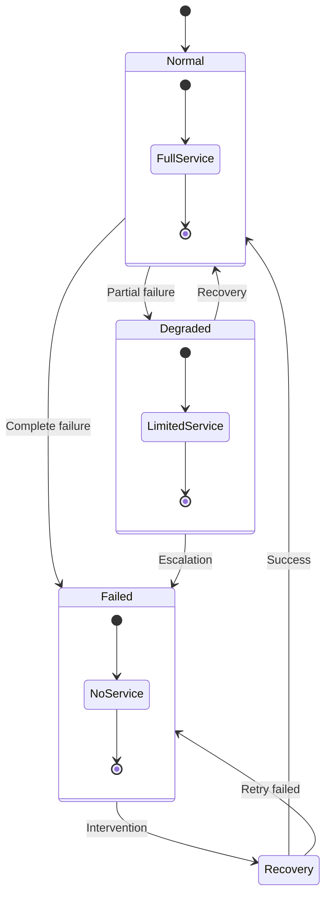

## Extension System Integration

### Plugin Architecture

The extension system allows seamless integration of additional functionality:

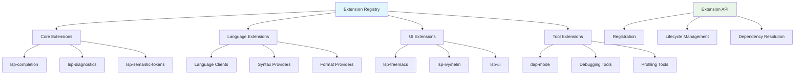

### Extension Lifecycle

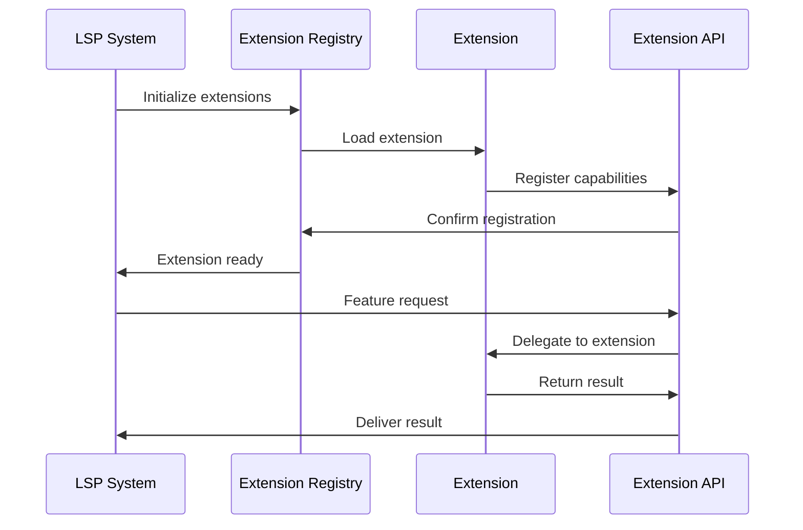

## Testing Integration Architecture

### Multi-Level Testing Strategy

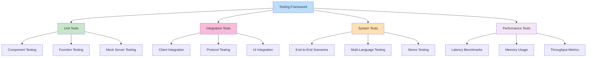

This integration architecture ensures that all components work together harmoniously while maintaining clear boundaries and enabling independent development and testing of individual subsystems.