# LSP Protocol Layer Architecture

This document details the protocol layer architecture of LSP Mode, focusing on the JSON-RPC communication patterns and message handling mechanisms.

## Protocol Stack Overview

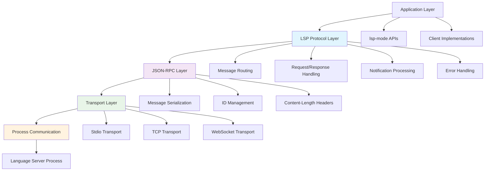

## Message Flow Architecture

### Request-Response Pattern

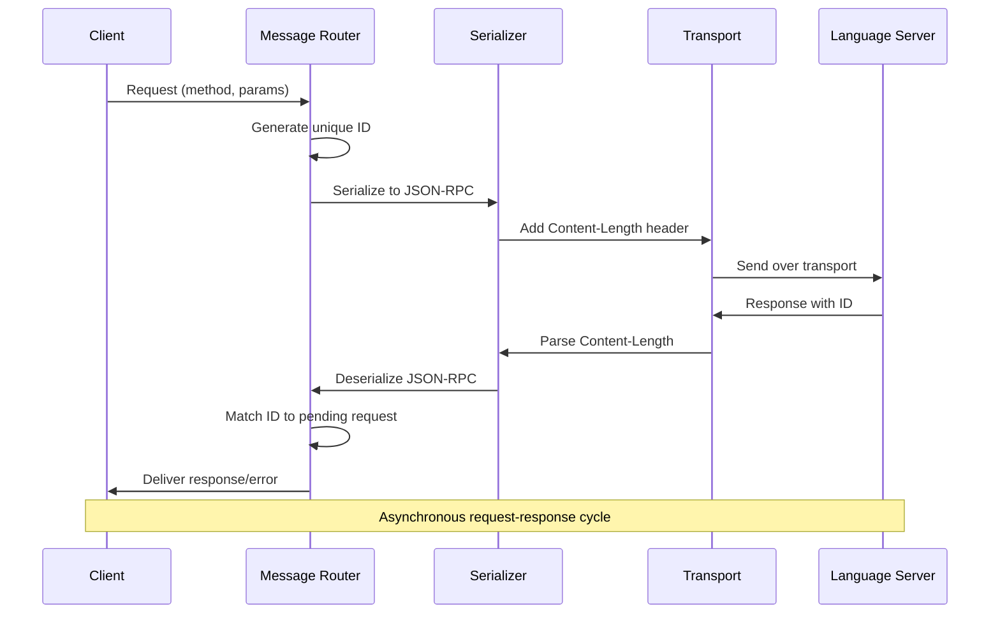

### Notification Pattern

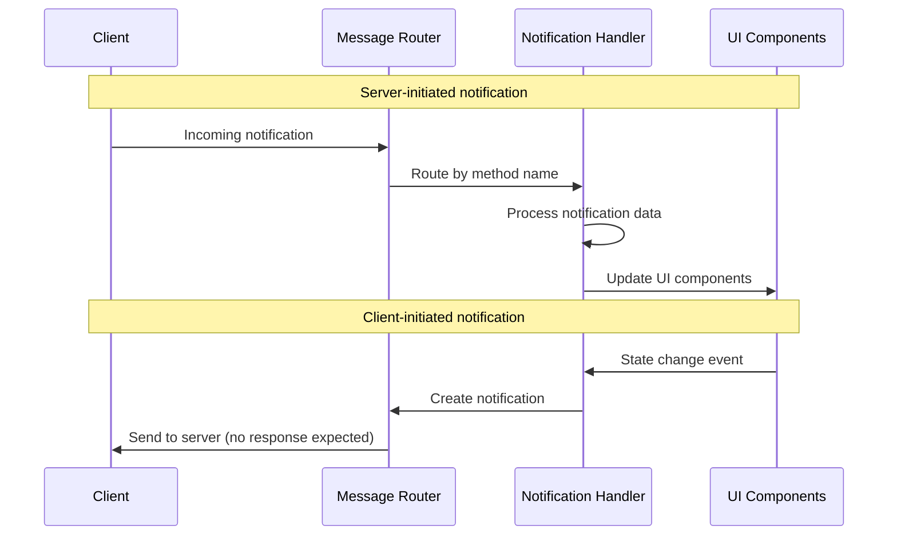

## Protocol Method Categories

### Document Synchronization

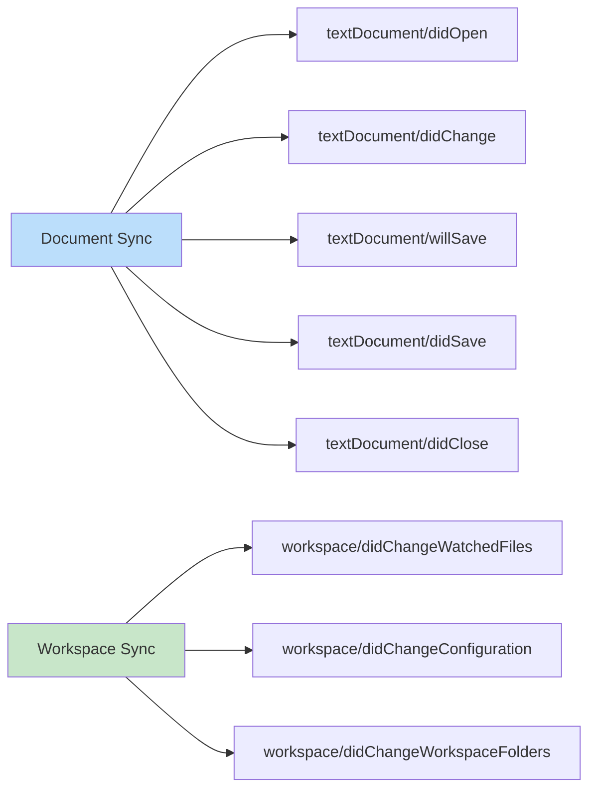

### Language Features

```mermaid
graph TD
    A[Language Features] --> B[Core Features]
    A --> C[Navigation Features]
    A --> D[Edit Features]
    A --> E[Information Features]
    
    B --> F[textDocument/completion]
    B --> G[textDocument/hover]
    B --> H[textDocument/signatureHelp]
    
    C --> I[textDocument/definition]
    C --> J[textDocument/references]
    C --> K[textDocument/implementation]
    C --> L[textDocument/typeDefinition]
    
    D --> M[textDocument/formatting]
    D --> N[textDocument/rangeFormatting]
    D --> O[textDocument/codeAction]
    D --> P[textDocument/rename]
    
    E --> Q[textDocument/documentSymbol]
    E --> R[textDocument/documentHighlight]
    E --> S[textDocument/codeLens]
    E --> T[textDocument/semanticTokens]
    
    style B fill:#e3f2fd
    style C fill:#e8f5e8
    style D fill:#fff3e0
    style E fill:#f3e5f5
```

## Transport Layer Implementation

### Stdio Transport

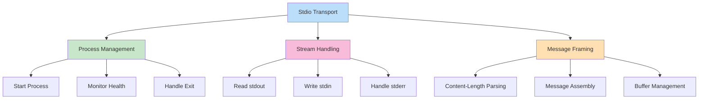

### TCP Transport

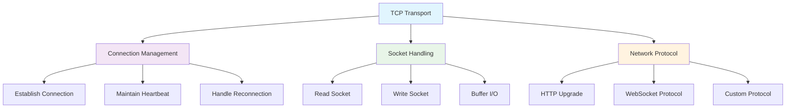

## Error Handling and Recovery

### Error Classification

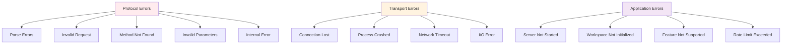

### Recovery Strategies

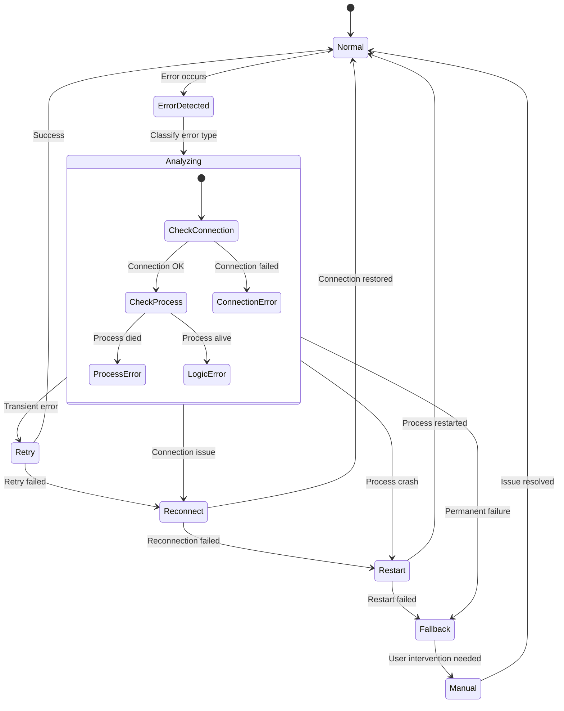

## Message Routing and Multiplexing

### Router Architecture

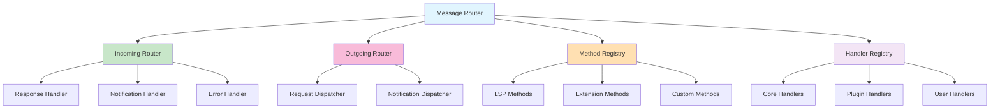

### Request Multiplexing

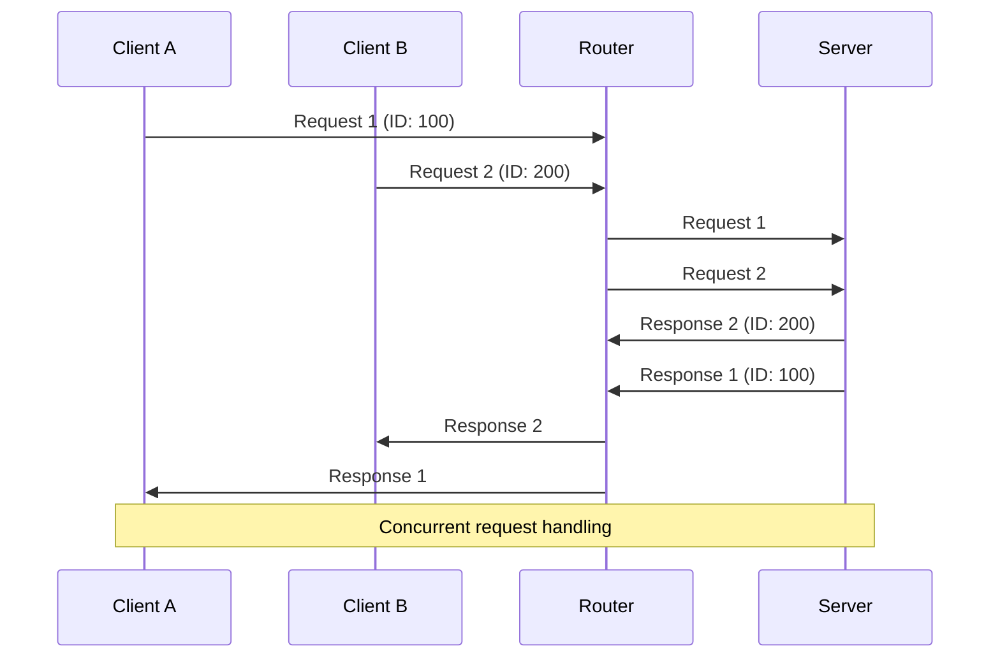

## Performance Optimization Patterns

### Request Batching

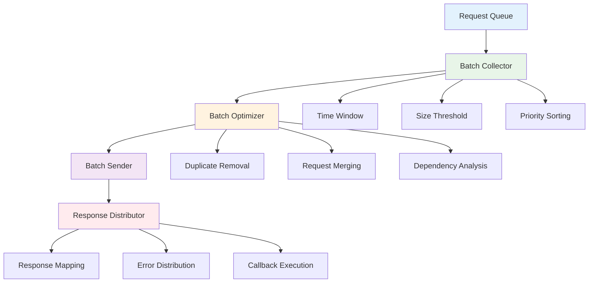

### Response Caching

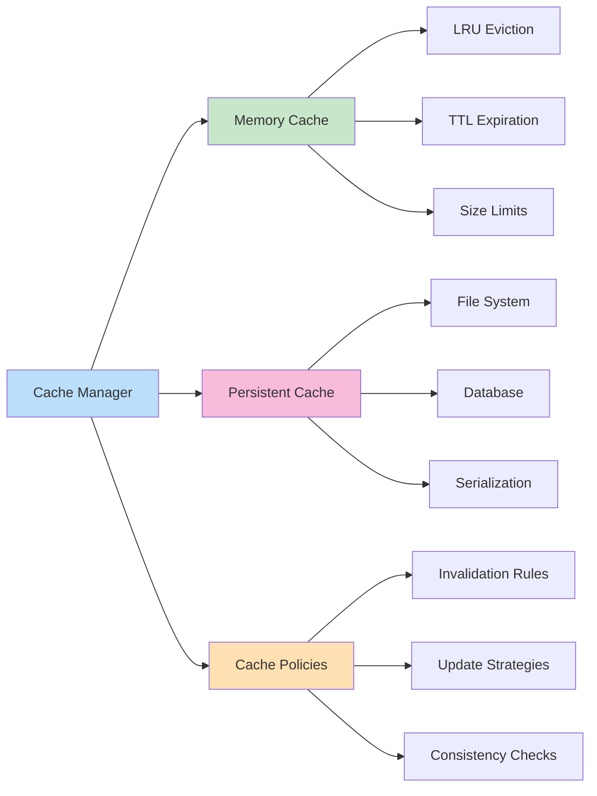

This protocol layer architecture enables efficient, reliable communication between LSP Mode and language servers while maintaining the flexibility to support diverse server implementations and transport mechanisms.