# UI Integration Architecture

This document details the user interface integration subsystem of LSP Mode, which handles the presentation layer and integration with Emacs UI components.

## UI Integration Overview

```mermaid
graph TD
    A[UI Integration Layer] --> B[Completion Interface]
    A --> C[Diagnostics Display]
    A --> D[Navigation Components]
    A --> E[Information Display]
    A --> F[Action Interfaces]
    
    B --> G[company-mode Integration]
    B --> H[completion-at-point]
    B --> I[Snippet Expansion]
    
    C --> J[Flycheck/Flymake Backend]
    C --> K[Modeline Indicators]
    C --> L[Overlay System]
    
    D --> M[xref Backend]
    D --> N[imenu Provider]
    D --> O[Navigation Commands]
    
    E --> P[eldoc Integration]
    E --> Q[which-key Integration]
    E --> R[Help System]
    
    F --> S[Code Actions Menu]
    F --> T[Quick Fix Interface]
    F --> U[Refactoring Tools]
    
    style A fill:#e1f5fe
    style B fill:#f3e5f5
    style C fill:#e8f5e8
    style D fill:#fff3e0
    style E fill:#ffebee
    style F fill:#f3e5f5
```

## Completion Integration Architecture

### Company Mode Integration

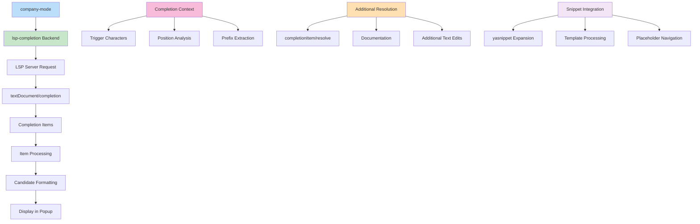

### Completion Flow Sequence

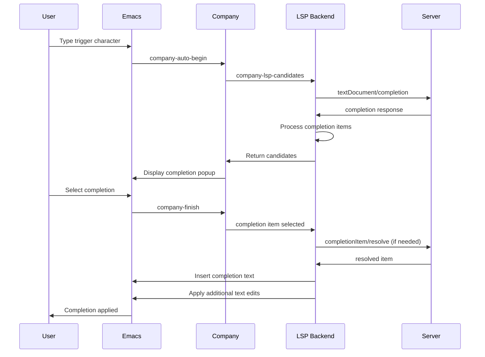

### Completion Item Processing

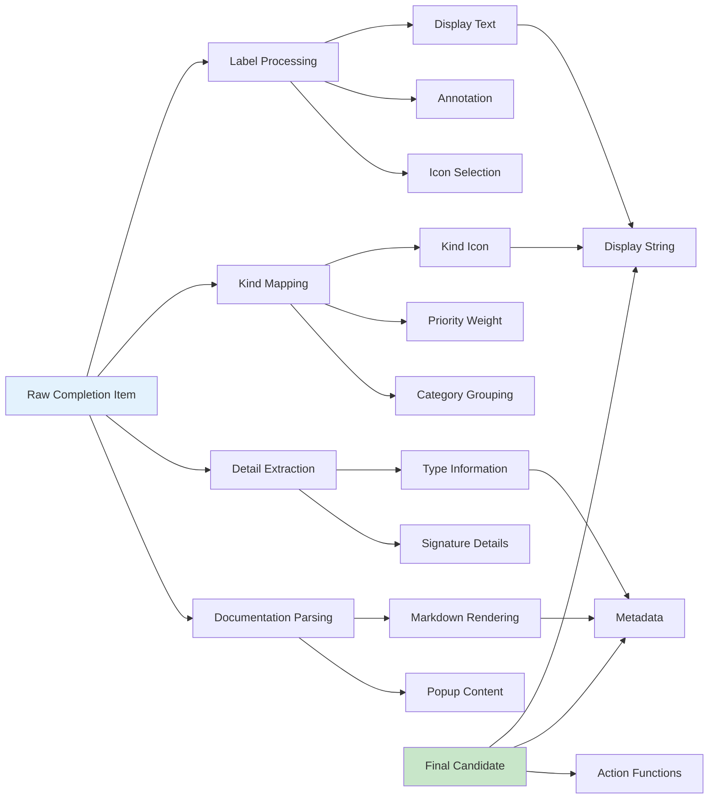

## Diagnostics Display System

### Multi-Backend Architecture

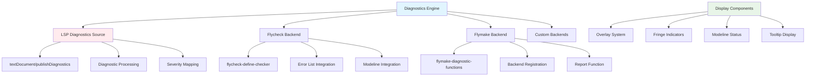

### Diagnostic Overlay Management

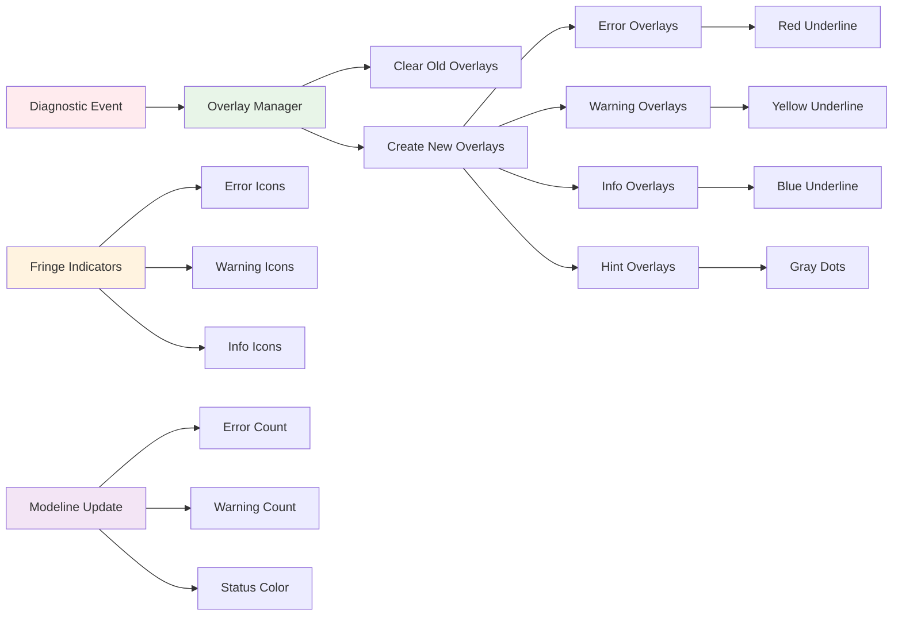

### Diagnostic Tooltip System

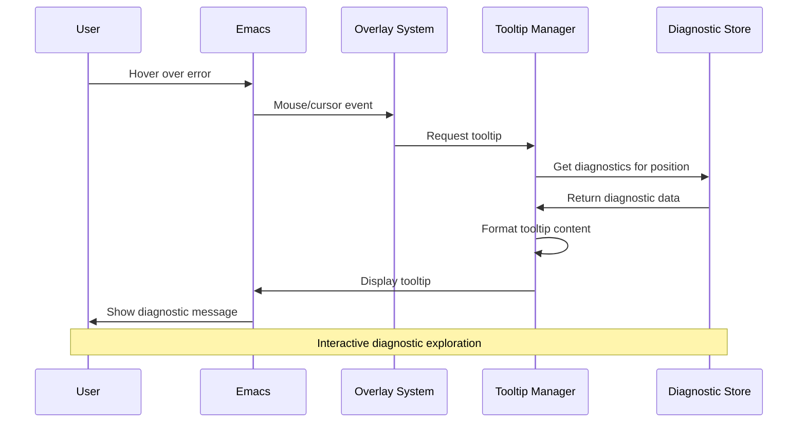

## Navigation and Information Display

### xref Backend Integration

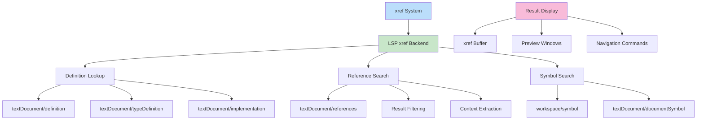

### Symbol Information Architecture

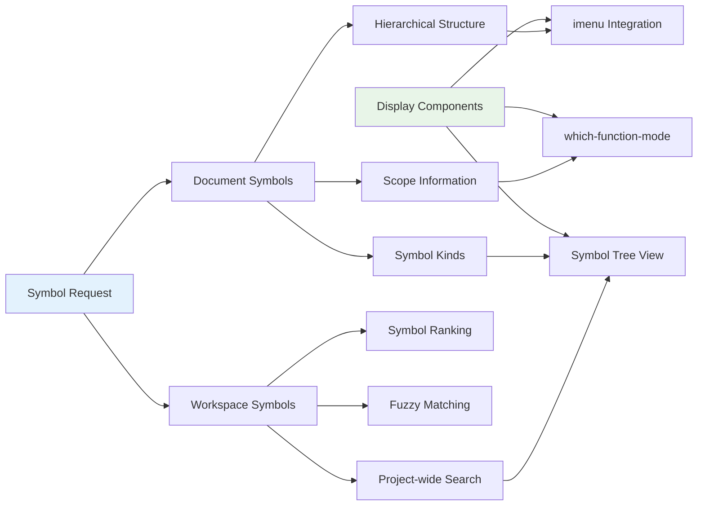

## Code Actions and Quick Fixes

### Action Discovery and Presentation

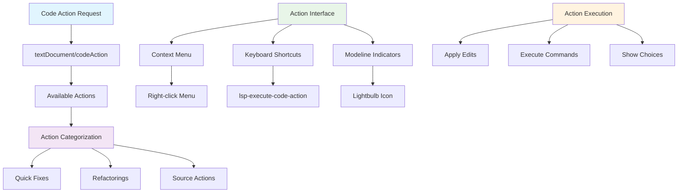

### Action Execution Flow

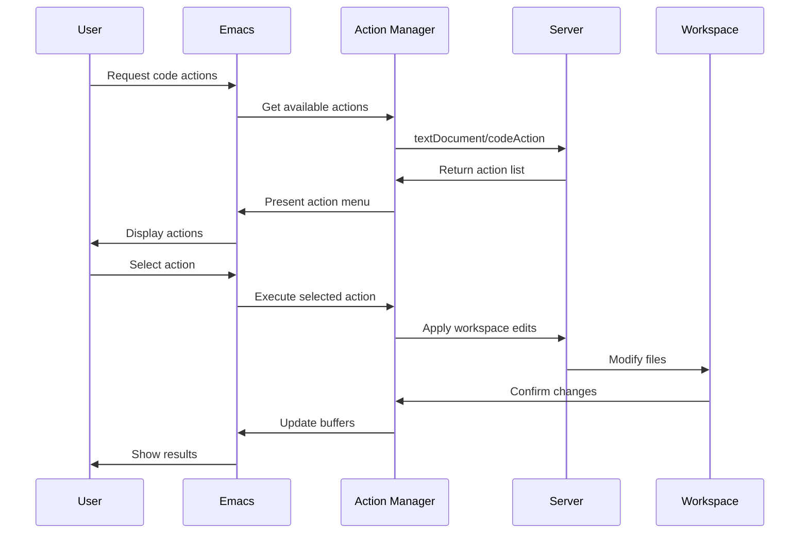

## Modeline and Headerline Integration

### Modeline Components Architecture

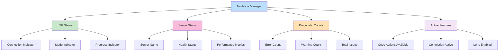

### Headerline Breadcrumb System

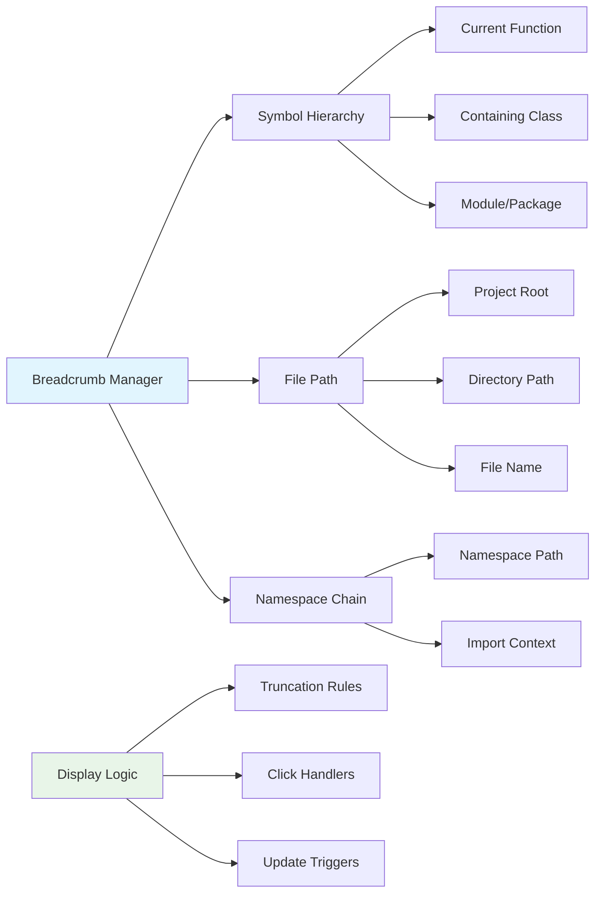

## Lens and Semantic Token Display

### Code Lens Integration

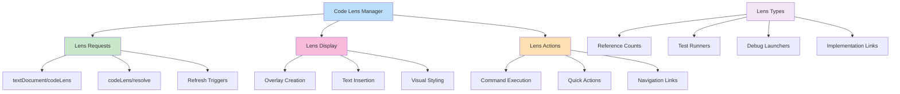

### Semantic Token Highlighting

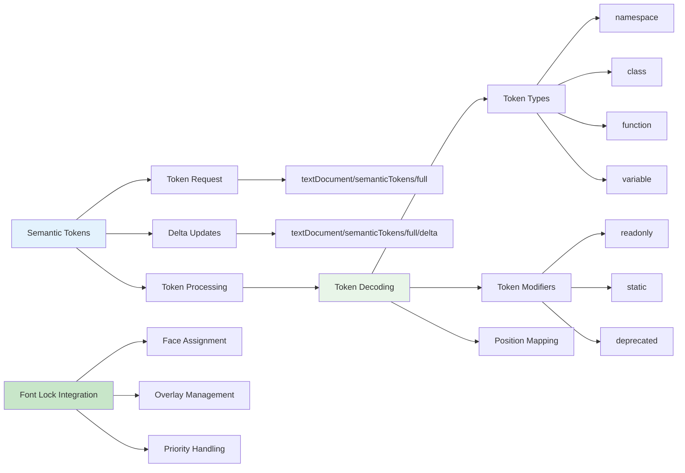

## Performance Optimization Patterns

### UI Update Throttling

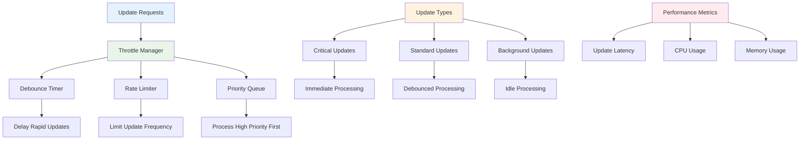

### Lazy Loading and Caching

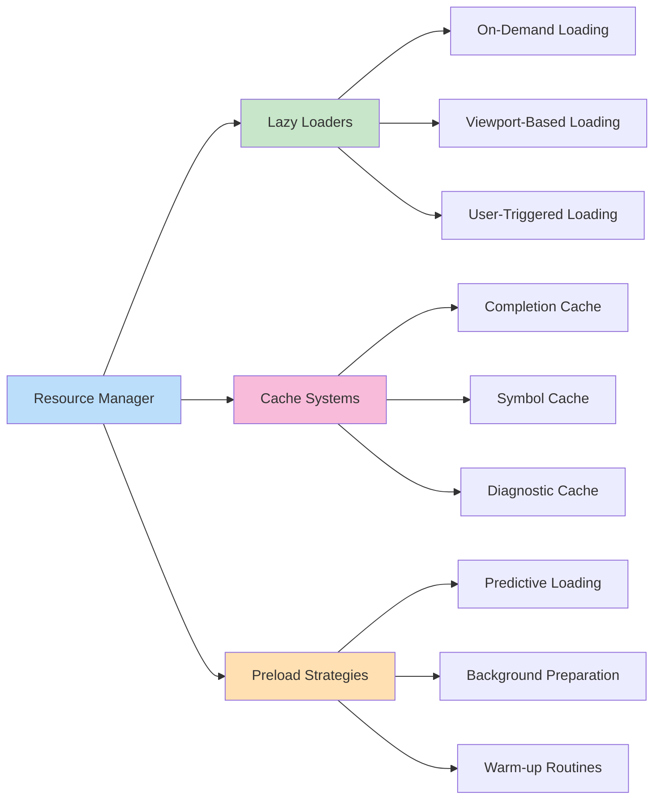

This UI integration architecture ensures seamless integration with Emacs' native UI systems while providing rich, responsive language-aware features through sophisticated caching, throttling, and lazy loading mechanisms.