# LSP Mode Architecture Documentation

This document provides comprehensive architecture documentation for LSP Mode, capturing the recursive and emergent nature of the system architecture through detailed Mermaid diagrams and analysis.

## System Overview

LSP Mode is a comprehensive Language Server Protocol client for Emacs that provides intelligent language features through integration with language servers. The architecture follows a modular, event-driven design with clear separation of concerns.

### High-Level System Architecture

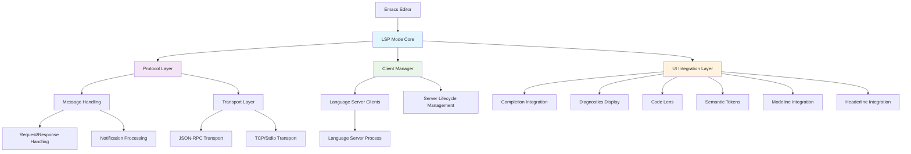

### Core Architectural Principles

1. **Modular Design**: Clear separation between protocol handling, client management, and UI integration
2. **Event-Driven Architecture**: Reactive programming model with hooks and callbacks
3. **Extensible Plugin System**: Language server clients as modular extensions
4. **Asynchronous Processing**: Non-blocking communication with language servers
5. **Adaptive Integration**: Flexible UI component integration with existing Emacs workflows

## Module Interaction Patterns

### Bidirectional Component Synergies

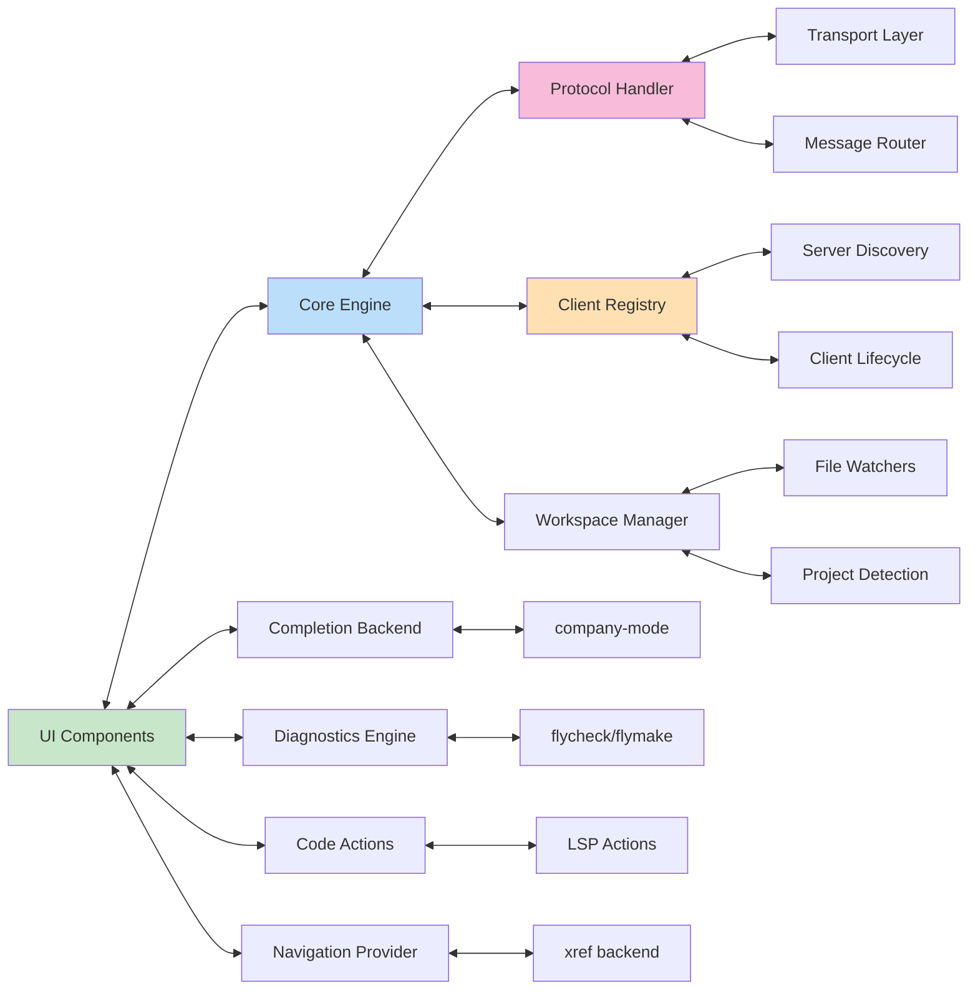

### Data Flow and Signal Propagation

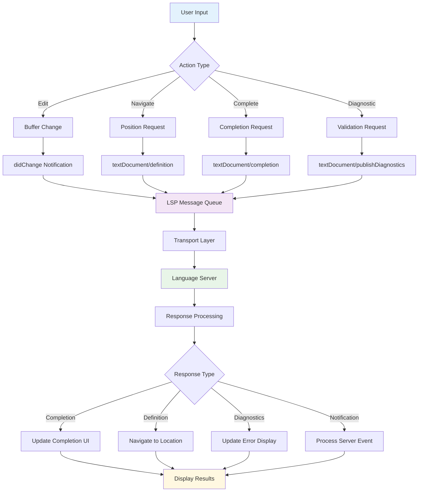

## Key Workflow Sequences

### Language Server Initialization Sequence

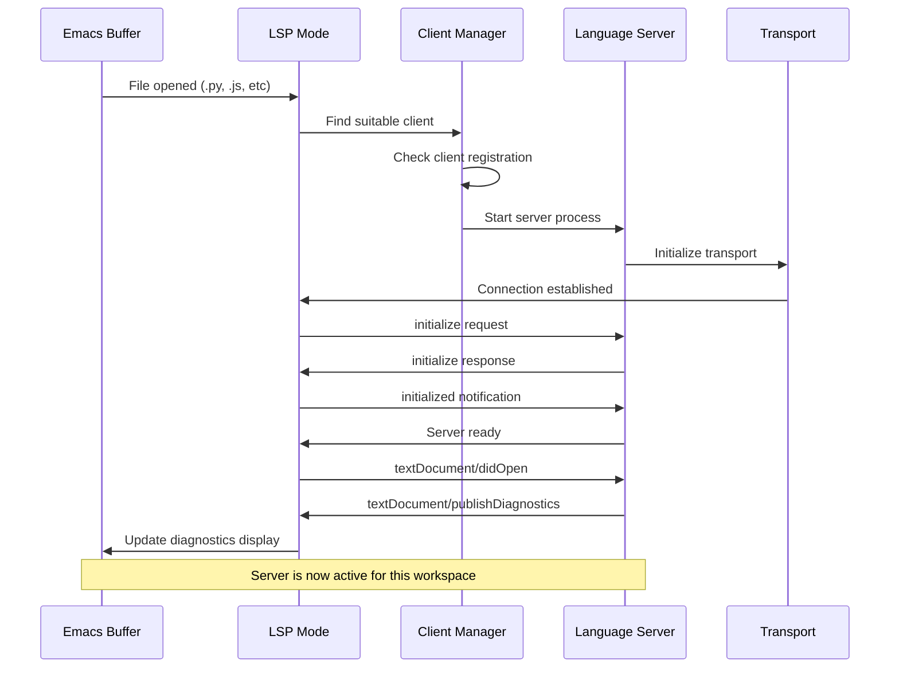

### Code Completion Workflow

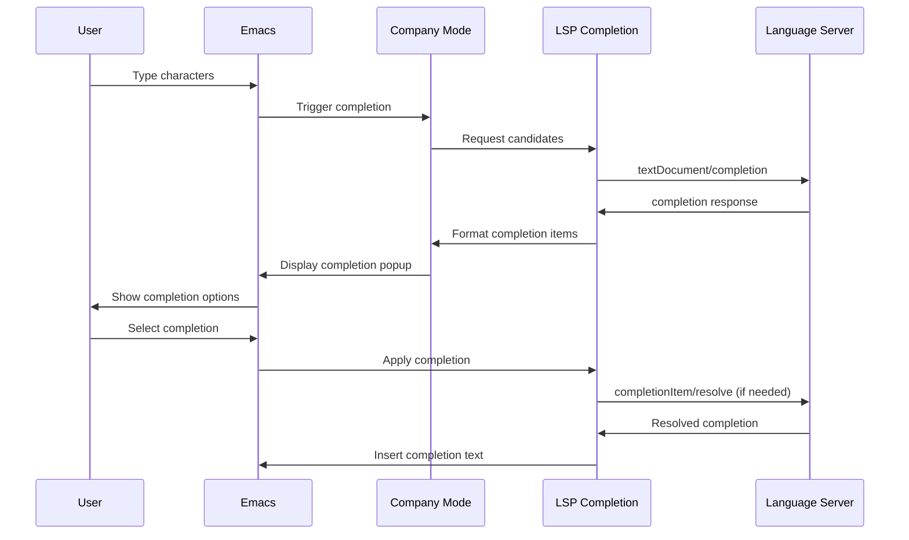

### Diagnostic Processing Flow

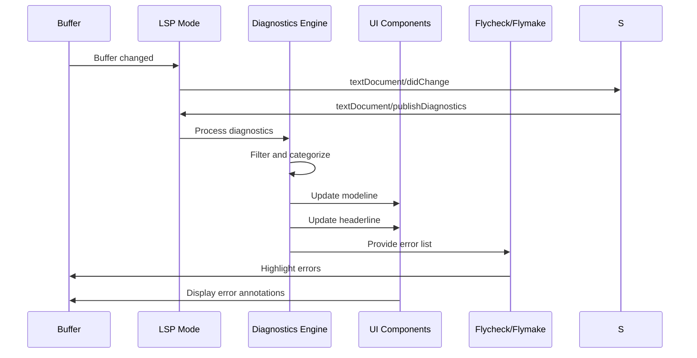

## Component State Management

### LSP Mode Core State Machine

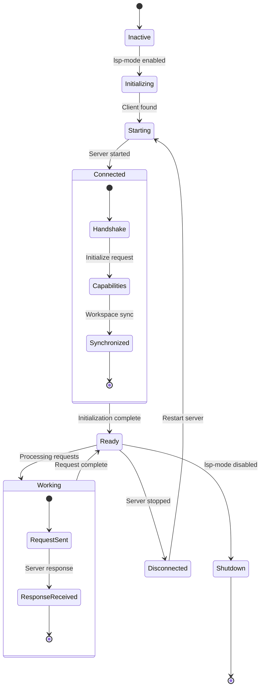

### Client Lifecycle Management

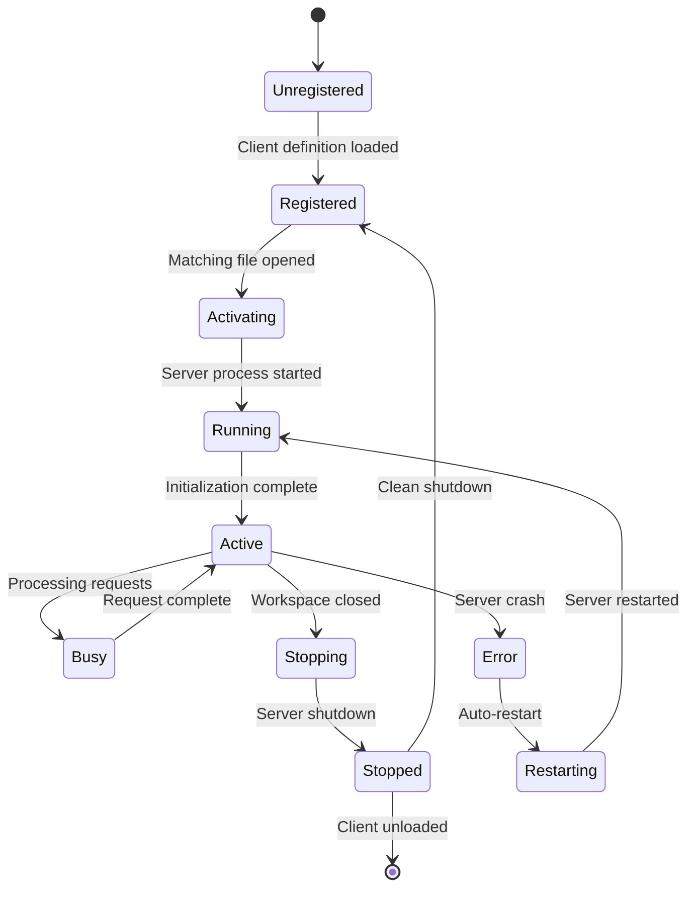

## Extension Points and Hooks

### Hook System Architecture

```mermaid
graph TB
    A[Core Hooks] --> B[lsp-mode-hook]
    A --> C[lsp-before-initialize-hook]
    A --> D[lsp-after-initialize-hook]
    A --> E[lsp-before-open-hook]
    A --> F[lsp-after-open-hook]
    
    G[Request Hooks] --> H[lsp-before-request-hook]
    G --> I[lsp-after-request-hook]
    G --> J[lsp-response-done-hook]
    
    K[UI Hooks] --> L[lsp-completion-hook]
    K --> M[lsp-diagnostics-hook]
    K --> N[lsp-code-actions-hook]
    
    O[Client Hooks] --> P[lsp-server-start-hook]
    O --> Q[lsp-server-stop-hook]
    O --> R[lsp-workspace-restart-hook]
    
    style A fill:#e1f5fe
    style G fill:#f3e5f5
    style K fill:#e8f5e8
    style O fill:#fff3e0
```

### Plugin Architecture

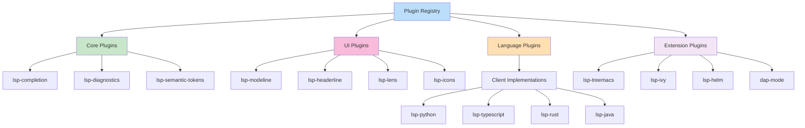

## Performance and Optimization Patterns

### Adaptive Attention Allocation

The system implements several cognitive optimization patterns:

1. **Request Debouncing**: Prevents excessive server requests during rapid typing
2. **Response Caching**: Stores frequently accessed information
3. **Lazy Loading**: Defers expensive operations until needed
4. **Background Processing**: Non-blocking asynchronous operations
5. **Resource Pooling**: Efficient management of server connections

### Memory Management Patterns

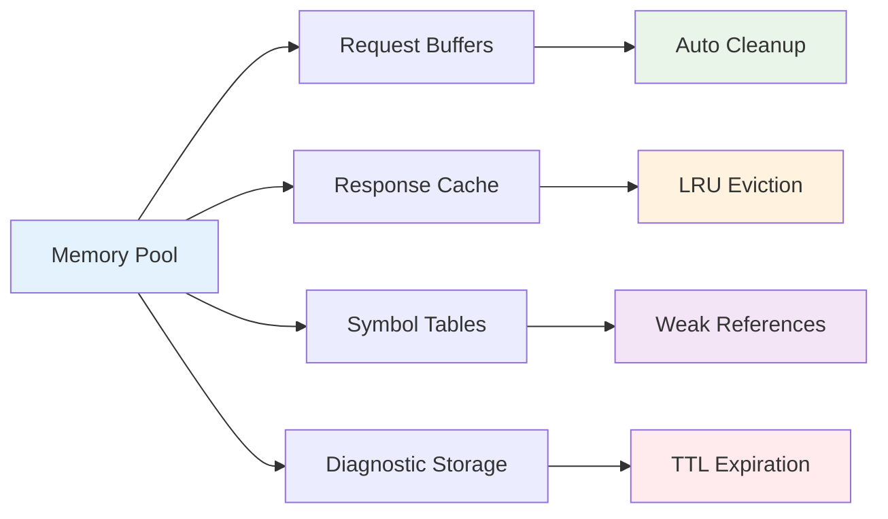

## Integration Patterns

### Emacs Integration Architecture

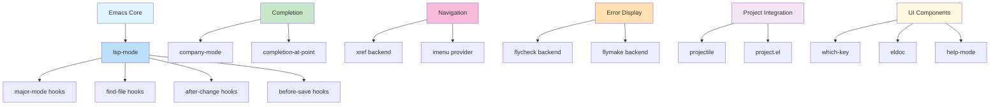

This architecture documentation provides a comprehensive view of LSP Mode's design, enabling contributors to understand the system's recursive patterns and emergent behaviors for effective collaboration and enhancement.